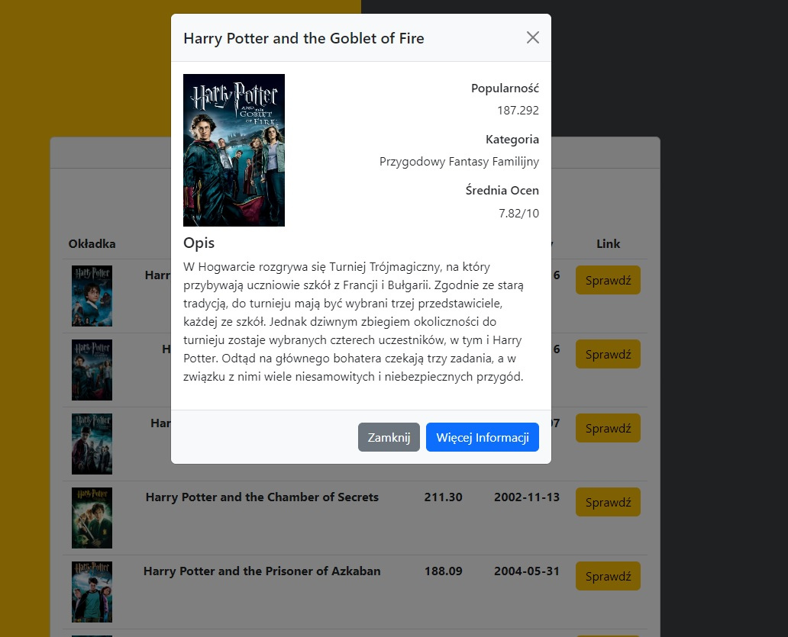

# :desktop_computer: MovieAPP

The application enables users to search for movies based on the entered title and presents the most important information about the selected movie. After displaying the results, the user can decide whether they want to learn more details by clicking the appropriate button. There, they will be presented with a short description and key information about the movie. Additionally, the user has the option to navigate to The Movie Database website to view additional information about the selected movie. The application utilizes The Movie Database API.

## :framed_picture: Screenshots

## :joystick: Demo

https://kamilkeder.github.io/MovieAPP/

## :e-mail: Feedback

If you have any feedback, please reach out to me at kontaktkkeder@gmail.com
